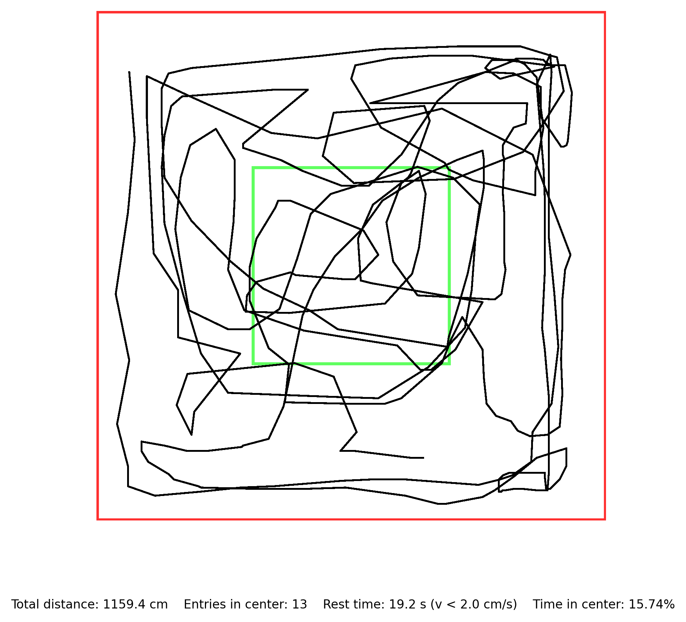

# 示例数据

完整的输入 → 输出示例，展示三阶段全流程。

---

## 目录结构

```
examples/
├── input/
│   └── 6.csv              ← Tracker 导出的原始数据（344帧，2分钟）
├── output/
│   ├── arena_6.png        ← plot_oft.py 生成的 300dpi 轨迹图
│   └── arena_6.csv        ← 结构化指标报告（4主指标 + 6验证 + 速度分布）
└── README.md              ← 本文件
```

---

## 快速体验：单文件分析

```bash
# 进入 oft-analysis 目录
cd 2_oft-analysis

# 处理示例数据（输出文件生成在当前工作目录；本例先进入 output 目录以便对照）
cd examples/output
python ../../scripts/plot_oft.py ../input/6.csv

# 输出：arena_6.png + arena_6.csv
```

### 输入格式（6.csv 前5行）

```csv
step,X,Y
1,925,421
2,929,471
3,924,525
4,915,585
5,925,634
```

### 输出：轨迹图（arena_6.png）



- 黑色线：小鼠运动轨迹
- 绿色虚线框：中心区（40%）
- 红色线：Arena 边界（50cm × 50cm）
- 底部：4个行为指标

### 输出：指标报告（arena_6.csv）

| 指标 | 值 |
|------|-----|
| Total distance | 1159.4 cm |
| Entries in center | 13 次 |
| Rest time | 19.2 s |
| Time in center | 15.74% |
| WARNINGs | 0（全部 PASS） |

---

## 批量分析 + 汇总

```bash
# 如果有多个文件（按实验组/时间点组织在目录中）
python scripts/generate_summary.py <results_dir> -o OFT_results_summary.csv
```

---

## 像素化

```bash
# 脚本位于步骤3目录
python ../../3_oft-pixelate/scripts/batch_pixelate.py <input_png_dir> <output_dir>
```
